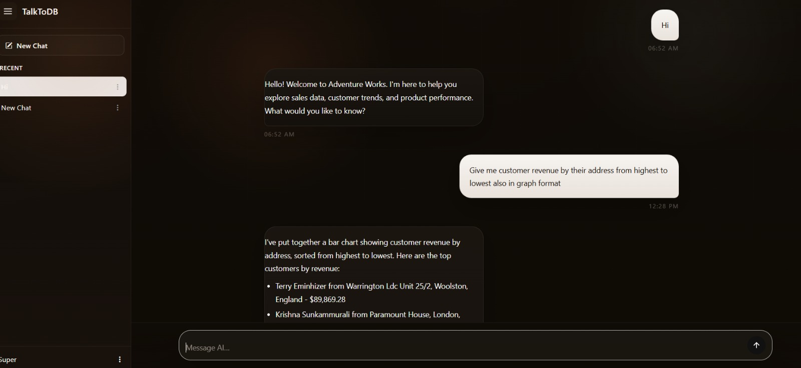

# TalkToDB — Agentic AI Text2SQL

A production-grade, multi-agent Text-to-SQL platform that lets business users query relational databases in natural language, with enterprise-grade role-based access control, admin tooling, and chart/Excel export — not just a raw SQL generator.

Built with LangGraph, FastAPI, and a .NET Core API layer. Tested against AdventureWorksLT2019.

## Demo

**Chat interface (TalkToDB):**
A user asks a natural-language question, the system generates and executes SQL under their role's permissions, then returns a chart and downloadable Excel file.




**Admin panel — Role & Access Management:**


**Admin panel — Agent Prompt Editor:**


*(Save your screenshots into a `docs/screenshots/` folder in the repo with these filenames, or rename the paths above to match yours.)*

## Overview

Most Text-to-SQL demos stop at "generate a query and hope it's right." TalkToDB is designed to be operated safely in production:

- **Role-aware SQL generation** — every query is constrained by the requesting user's role permissions before it ever executes
- **Row-level and column-level access control** — admins can restrict a role to specific tables, specific columns within a table (e.g. hiding `PasswordHash`/`PasswordSalt`), or specific rows via required filters (e.g. a `Customer` role only sees rows matching their own `CustomerID`)
- **Self-correcting pipeline** — validation, retry, and refinement loops catch and fix failed or incorrect SQL before returning a result
- **Full admin control surface** — roles, database connections, permission sets, column exclusions, and every agent's system prompt are all editable from an admin UI, with no redeployment needed to tune agent behavior

## Multi-Agent Architecture

Each stage of the pipeline is a dedicated agent/system with its own configurable prompt (editable live via the Prompt Editor):

| Agent | Role |
|---|---|
| `INTENT_CLASSIFIER_SYSTEM` | Routes the incoming query to SQL_QUERY, EXPLAIN, SUMMARIZE, GREETING, or NEEDS_CLARITY |
| `REFINER_SYSTEM` | Context-linking classifier — decides whether a new query should be merged with prior conversation turns, treated independently, or reconstructed after a SQL execution failure |
| `DECOMPOSITION_SYSTEM` | Breaks complex questions into smaller sub-steps for generation |
| `SCHEMA_SEED_FILTER_SYSTEM` | Narrows the schema search space before retrieval |
| `SCHEMA_SUFFICIENCY_SYSTEM` | Checks whether retrieved schema context is sufficient to answer the query, before generation proceeds |
| `SQL_GENERATION_SYSTEM` | Generates the SQL query from the resolved intent + schema context |
| `SQL_VALIDATION_SYSTEM` | Validates generated SQL for correctness and permission compliance before execution |
| `SQL_RESULTS_VALIDATOR_SYSTEM` | Validates the *results* of execution — a Self-RAG-style post-execution check with retry on failure |
| `VIEWS_SUGGESTION_SYSTEM` | Suggests relevant chart/view types for the result set (bar chart, table, etc.) |
| `VIEWS_GRADER_SYSTEM` | Grades/ranks the suggested views for relevance to the query |
| `GENERATE_RESPONSE_SYSTEM` | Produces the final natural-language response returned to the user |

Retrieval is handled by a **ChromaDB-based schema Self-RAG loop** (RETRIEVE → ISREL → ISSUP → ISUSE), and each stage's prompt lives in the database and is hot-editable — new business logic can be tuned without touching code.

## Role-Based Access Control (RBAC)

Configured per-role, per-database-connection, through the **Permission Set Creator**:

1. Select a database connection and a role (e.g. `SuperAdmin`, `Customer`, `HR`)
2. Select which tables that role can access
3. For each table, set access as **Unrestricted** or **Filtered**
4. Filtered tables require **row-level filters** (e.g. `CustomerID`, `AddressID`) so a role only ever sees rows scoped to them
5. Separately, **Column Exclusions** hide specific sensitive columns (e.g. `PasswordHash`, `PasswordSalt`) from a table entirely, regardless of role
6. The resulting permission set is exported as a JSON payload and enforced at query time via a live `Get-Runtime` permissions endpoint, with per-user permission caching

This means the same natural-language question returns different, correctly-scoped SQL and results depending on who's asking.

## Admin Panel Features

- **Role Management** — create roles, view members, assign database access per role
- **Database Connections** — add/edit/test SQL Server connections (server, database, credentials, timeout, trust certificate)
- **Permission Set Creator** — table/column/row-level access control per role (above)
- **Column Exclusions** — global sensitive-column hiding per database/table
- **User Lookup Configuration** — maps a role + connection to the tenant's actual user table/column, so the system knows how to resolve "my data" for a given role
- **Prompt Editor** — live-edit the system prompt for any of the 11 agents listed above

## Chat Product (TalkToDB)

- Natural-language querying with full conversation memory (last 5 turns)
- Automatic chart generation (e.g. bar chart of customer revenue by address, sorted descending)
- One-click Excel export of any result set
- Follow-up requests (e.g. "give me same data in excel format") reuse prior context via the Refiner agent rather than re-querying from scratch

## Project Structure

AGENTIC_AI_TEXT2SQL/
├── src/ # Core agent and pipeline logic
├── scripts/ # Setup / utility scripts
├── tests/ # Test suite
├── logs/ # Runtime logs
├── permissions.json # RBAC role/permission config
├── nvidia_models.json # Model configuration
├── init.py
└── requirements.txt


## APIs

*(Inferred from the admin UI and chat product — confirm/rename to match your actual route names.)*

| Endpoint (example) | Purpose |
|---|---|
| `POST /chat` | Submit a natural-language query, returns SQL result, chart, and/or Excel export |
| `GET/POST /roles` | List / create roles |
| `DELETE /roles/{id}` | Delete a role |
| `GET/POST /connections` | List / add database connections |
| `POST /connections/test` | Test & save a new connection |
| `PUT/DELETE /connections/{id}` | Edit / delete a connection |
| `POST /permissions` | Create/update a permission set (tables, access level, row filters) for a role + connection |
| `GET /permissions/runtime` | Live `Get-Runtime` endpoint — resolves a role's current permissions at query time |
| `GET/POST /column-exclusions` | List / add column exclusions per database/table |
| `GET/POST /user-lookup` | Configure tenant user lookup schema (role + connection → user table/column) |
| `GET/PUT /prompts/{function_name}` | Fetch / update a given agent's system prompt |
| `GET /export/excel/{result_id}` | Download a query result set as Excel |

## Tech Stack

- **Agent orchestration:** LangGraph, LangChain
- **Backend (agent layer):** FastAPI (Python 3.11 — required for ChromaDB/onnxruntime compatibility)
- **Backend (API layer):** .NET Core
- **Retrieval:** ChromaDB
- **LLMs:** Groq, with a self-hosted Ollama (`llama3.1:8b`) fallback via Colab + ngrok
- **Admin UI:** JavaScript (role/RBAC configuration, prompt editor, connection management)

## Setup

```bash
git clone https://github.com/Parash-Tamang/AGENTIC_AI_TEXT2SQL.git
cd AGENTIC_AI_TEXT2SQL
python3.11 -m venv venv
source venv/bin/activate  # venv\Scripts\activate on Windows
pip install -r requirements.txt
```

*(Add `.env` setup — Groq API key, DB connection string, etc.)*

## Status

Actively developed — architecture, admin tooling, and documentation ongoing.
