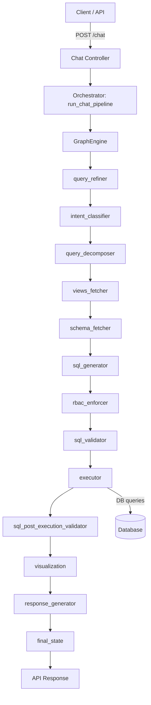

**Pipeline Architecture**

This document describes the end-to-end architecture of the chat → text-to-SQL pipeline implemented in this repository, including node inputs and outputs, retry behavior, RBAC handling, and the API contract.

**Overview**
- **API Controller**: receives requests at `/chat`, prepares connection/context, and calls the orchestrator. See [src/agent/controller/chat_controller.py](src/agent/controller/chat_controller.py).
- **Orchestrator**: builds the pipeline state and runs a graph engine over the registered nodes. See [src/agent/orchestrator/chat.py](src/agent/orchestrator/chat.py).
- **Graph Engine**: executes nodes in sequence (the node registry in the orchestrator defines inputs/outputs for each node).
- **Nodes**: individual functional units (query refinement, SQL generation, RBAC enforcement, execution, visualization, response generation, etc.). Node design and responsibilities are documented in [src/agent/nodes/ARCHITECTURE.md](src/agent/nodes/ARCHITECTURE.md).
- **Session Context**: canonical per-session fields are extracted into a `SessionContext` model for persistence and API responses. See [src/agent/memory/session_context.py](src/agent/memory/session_context.py).

**High-level Flow (Inputs → Outputs)**

**Key Node Inputs & Outputs (summary)**
- `query_refiner`
  - Inputs: `user_query`, `history`, optional `retry_feedback`
  - Outputs: `construct`, `refined_query`
- `intent_classifier`
  - Inputs: `user_query`, `refined_query`, `history`, `domain_context`
  - Outputs: `intent` (object with `intent` field)
- `query_decomposer`
  - Inputs: `refined_query`, `intent`, `construct`
  - Outputs: `decomposed`
- `views_fetcher`
  - Inputs: `construct`, `decomposed`, `history`, `intent`
  - Outputs: `views`, `views_grade`, `view_suggestions`
- `schema_fetcher`
  - Inputs: `construct`, `decomposed`, `views`, `views_grade`
  - Outputs: `retrieved_schemas`, `seed_tables`, `join_paths`
- `sql_generator`
  - Inputs: `construct`, `retrieved_schemas`, `seed_tables`, `join_paths`, `views`, `retry_feedback`
  - Outputs: `generated_sql`, `token_count`, `hallucinated_tables`
- `rbac_enforcer`
  - Inputs: `generated_sql`, `allowed_tables`, `mandatory_filters`
  - Outputs: `generated_sql` (possibly modified), `permission_denied`, `user_facing_response`, `validation_result`, `rbac_enforced_filters`
  - Behavior: if `permission_denied` is true, orchestrator may retry (up to 3) with `retry_feedback` before returning a final denial message.
- `sql_validator`
  - Inputs: `generated_sql`, `retrieved_schemas`, `seed_tables`, `join_paths`
  - Outputs: `validation_passed`, `validation_result`, `validation_errors`
- `executor`
  - Inputs: `generated_sql`, DB connection details (`db_type`, `server`, `database`, `username`, `password`, `port`, `pool_size`, `timeout`)
  - Outputs: `execution_result` (rows, metadata) — may include typed error codes for permission issues
- `sql_post_execution_validator`
  - Inputs: `execution_result`, `generated_sql`, `retrieved_schemas`, `construct`
  - Outputs: `validation_passed`, `validation_error`, `sql_errors`, `self_rag_decision`, `execution_analysis`
- `visualization`
  - Inputs: `execution_result`, `generated_sql`, `sanitised_schema`, `construct`
  - Outputs: `graph_data` (chart type, image bytes/base64, reasoning)
- `response_generator`
  - Inputs: `user_query`, `history`, `intent`, `construct`, `generated_sql`, `execution_result`, `graph_data`, `execution_analysis`, `retrieved_schemas`, `view_suggestions`
  - Outputs: `user_facing_response`, token breakdown, flags

**Retry & RBAC Policy (current implementation)**
- The orchestrator runs the GraphEngine and inspects `final_state`.
- If `permission_denied` is set by `rbac_enforcer`, or if no SQL was produced (`generated_sql` missing), the orchestrator will retry the engine run up to 3 times.
  - Each retry passes `retry_count` and `retry_feedback` into the pipeline so nodes can adjust (e.g., refiner can change constraints).
  - After 3 unsuccessful attempts, the orchestrator sets `user_facing_response` to either "You have no permission." (RBAC) or "Unable to generate SQL after 3 attempts." (no SQL) and returns the final state.

**Session Context and API Response**
- The orchestrator enriches `final_state` with canonical `last_*` fields before returning; examples:
  - `last_refined_query`, `last_intent`, `last_confirmed_sql`, `last_tables_used`, `last_filters`, `last_skeleton_id`, `turn_count`.
- The controller extracts a `SessionContext` using `extract_from_state` and returns `session_context.model_dump()` to callers. See [src/agent/memory/session_context.py](src/agent/memory/session_context.py).
- The API response (`data`) includes:
  - `response`: the `user_facing_response` text
  - `session_context`: the canonical session payload (includes `last_confirmed_sql` when available)
  - `graph`: visualization summary and PNG/base64 if available
  - `excel`: optional tabular export payload

**Failure modes & error handling**
- Permission errors from DB execution may surface as error codes; `executor` or database helpers map DB error codes to `PERMISSION_DENIED` or other categories. See `src/database/config/error_code.py` for mappings.
- Nodes should surface structured `validation_errors` to the `sql_post_execution_validator` for self-RAG and retry decisions.

**Where to look in code**
- Controller: [src/agent/controller/chat_controller.py](src/agent/controller/chat_controller.py)
- Orchestrator / pipeline: [src/agent/orchestrator/chat.py](src/agent/orchestrator/chat.py)
- Session model: [src/agent/memory/session_context.py](src/agent/memory/session_context.py)
- Node architecture overview: [src/agent/nodes/ARCHITECTURE.md](src/agent/nodes/ARCHITECTURE.md)

**Next steps / suggestions**
- Add explicit unit tests for retry behavior by stubbing `rbac_enforcer` and `sql_generator` to produce permission/no-sql conditions.
- Make the retry policy configurable (max attempts, backoff, separate policies for RBAC vs generation).
- Add observability metrics for retry counts, permission_denied events, and SQL generation failures.

---

Generated on: 2026-05-31
