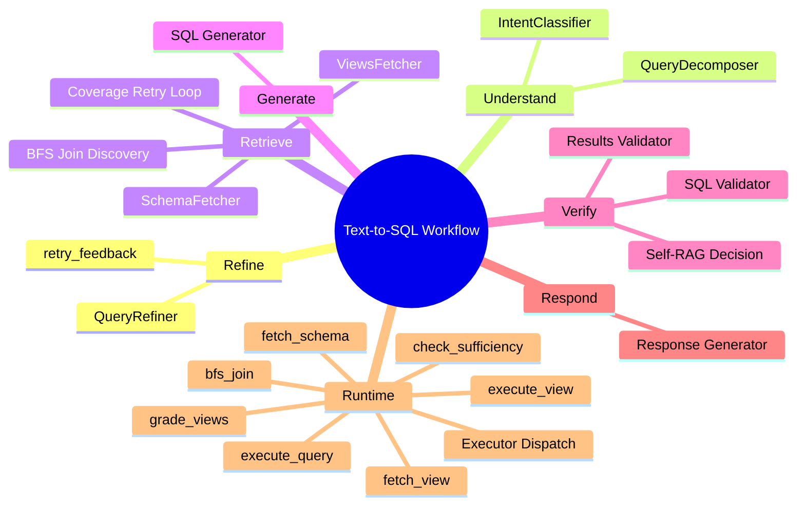

# Sub-Agent Architecture

This document describes the architecture, components, data flow, and extensibility points for the `sub_agent` package in this repository.

## Overview

The `sub_agent` folder implements a small LangGraph-style RAG pipeline focused on Text‑to‑SQL generation and post‑execution validation. It separates deterministic, schema-driven checks from fuzzy, LLM-based semantic checks and includes a deterministic Self‑RAG decision layer to decide whether to regenerate SQL.

Key goals:
- Keep deterministic checks (syntax, schema, aggregation, execution analysis) outside the LLM.
- Use LLMs only for semantic, business-reasoning judgments.
- Persist append-only JSONL logs for traceability.
- Expose small, testable "node" functions that accept and return a shared `state` dict.

## Current Architecture

This section reflects the current workflow in the repository. The legacy notes below are kept for context only.

### Node Graph

| Order | Node | File | Reads | Writes | Role |
| --- | --- | --- | --- | --- | --- |
| 1 | Query Refiner | `src/agent/nodes/query_refiner.py` | `user_query`, `history`, `retry_feedback` | `construct`, `refined_query` | Refines the user request and switches to `RETRY` when validator feedback exists. |
| 2 | Query Decomposer | `src/agent/nodes/decomposition.py` | `refined_query`, `domain_context` | `decomposed` | Splits composite requests into ordered sub-queries. |
| 3 | Intent Classifier | `src/agent/nodes/intent_classifier.py` | `refined_query`, `domain_context` | `intent` | Routes the request to SQL generation or narrative response flow. |
| 4 | Views Fetcher | `src/agent/nodes/views_agent.py` | `construct`, `decomposed` | `views`, `views_grade`, `view_suggestions` | Retrieves views, grades structural coverage, and emits follow-up chips. |
| 5 | Schema Fetcher | `src/agent/nodes/schema_agent.py` | `construct`, `decomposed`, `views_grade` | `schemas`, `retrieved_schemas`, `seed_tables`, `join_paths`, `schema_coverage`, `schema_coverage_history` | Fetches schemas, runs BFS join discovery, and validates schema sufficiency with retry fetches. |
| 6 | SQL Generator | SQL generator node/module | `refined_query`, `retrieved_schemas`, `seed_tables`, `join_paths`, `views` | `generated_sql`, `token_count`, `token_breakdown` | Builds SQL from the final schema context. |
| 7 | SQL Validator | SQL validator node/module | `generated_sql`, `retrieved_schemas`, `join_paths` | `validation_result`, `validation_passed`, `hallucinated_tables` | Deterministic SQL correctness checks. |
| 8 | Results Validator / Self-RAG | SQL results validator node/module | `generated_sql`, execution output, `validation_result` | `execution_analysis`, `validation_with_llm`, `self_rag_decision`, `execution_issues` | Decides whether to retry generation after execution. |
| 9 | Response Generator | response node/module | validated SQL/result state | `user_facing_response` | Formats the final answer for the user. |

### State Data Map

| State Key | Type | Produced By | Consumed By | Purpose |
| --- | --- | --- | --- | --- |
| `user_query` | `str` | caller | refiner | Raw user input. |
| `history` | `list[dict]` | caller | refiner | Prior chat context. |
| `retry_feedback` | `dict` / `RetryFeedback` | validator/orchestrator | refiner | Triggers query reconstruction with retry context. |
| `construct` | `dict` | refiner | decomposer, intent, schema agent | Refined query and classification. |
| `refined_query` | `str` | refiner | decomposer, intent, schema/sql generators | Stable query text passed downstream. |
| `decomposed` | `dict` | decomposer | schema agent, views agent | Composite query breakdown. |
| `intent` | `dict` | intent classifier | router, response nodes | Routing and output format. |
| `views` | `dict` | views agent | schema agent, SQL generator | Retrieved view documents. |
| `views_grade` | `dict` | views agent | schema agent | Structural signals for schema seeding. |
| `view_suggestions` | `list[dict]` | views agent | UI / follow-up handlers | Suggested follow-up views. |
| `schemas` | `dict` | schema agent | SQL generator / diagnostics | Serialized schema fetch state. |
| `retrieved_schemas` | `list[dict]` | schema agent | SQL generator | Final schema documents for SQL writing. |
| `seed_tables` | `list[str]` | schema agent | SQL generator | Primary tables chosen for the query. |
| `join_paths` | `list` | schema agent | SQL generator | Join relationships discovered by BFS. |
| `schema_coverage` | `dict` | schema agent | diagnostics / SQL generator | Latest sufficiency validation result. |
| `schema_coverage_history` | `list[dict]` | schema agent | diagnostics | Full retry history from the validator loop. |
| `generated_sql` | `str` | SQL generator | validators / executor | SQL text to run against the database. |
| `execution_result` | `dict` | executor / post-execution validator | response generator / results validator | Raw rows, rowcount, and execution error from the DB run. |
| `validation_result` | `dict` | SQL validator | results validator / retry logic | Static SQL validation output. |
| `validation_errors` | `list[str]` | SQL validator | orchestrator / retry logic | Human-readable validation issues. |
| `suggested_fix` | `str` | SQL validator | query refiner / orchestrator | Concrete SQL rewrite hint when retry is needed. |
| `execution_analysis` | `dict` | results validator | orchestrator | Deterministic row-level analysis. |
| `self_rag_decision` | `dict` | results validator | orchestrator | Final retry/no-retry decision. |
| `user_facing_response` | `str` | response generator | caller/UI | Final natural language answer. |

### Executor Contract

`src/agent/tools/executor.py` is the tool boundary between nodes and the runtime services.

| Tool | Input | Output | Used For |
| --- | --- | --- | --- |
| `execute_query` | `sql`, row limits, optional expected columns | execution result dict | Running final SQL against the DB. |
| `execute_view` | `view_name`, optional schema | execution result dict | Running a prebuilt view directly. |
| `fetch_schema` | `query`, `top_k`, optional `table_name` / `schema_name` | list of schema dicts | Semantic schema retrieval and exact metadata fetch. |
| `fetch_view` | `query`, `top_k`, optional `view_name` / `schema_name` | list of view dicts | Semantic view retrieval. |
| `bfs_join` | `seed_tables`, `max_hops`, optional `token_limit` | join paths + discovered tables | Deterministic join discovery from FK graph. |
| `grade_views` | `query`, `view_names`, `view_docs` | yes/no grade dict | Lightweight structural view grading. |
| `check_sufficiency` | `query`, `view_names` | sufficiency dict | Lightweight sufficiency check for view coverage. |

### Mermaid Mind Map



## Legacy Components (historical reference)

- SQL Generator
  - Path: `src/agent/sub_agent/sql_generator.py`
  - Purpose: Build schema-aware prompts and call LLM to produce a single JSON response containing `sql`, `tables_used`, `reasoning` and `hallucination_check`.
  - Key behaviors: sqlglot-based table extraction, token counting, retry loop with forbidden-table injection, JSONL logging (`logs/sql_generation.jsonl`).

- Structural Validator
  - Path: `src/agent/sub_agent/sql_validator.py`
  - Purpose: Deterministic AST/schema checks using `sqlglot`.
  - Checks: syntax, table existence, column existence, GROUP BY completeness, aggregation checks.
  - Node: `sql_validator_node(...)` which can accept `execution_result` and run deterministic execution checks (duplicates, null analysis, join explosion heuristic).

- Post-Execution Results Validator (Self-RAG)
  - Path: `src/agent/sub_agent/sql_results_validator.py` and `src/agent/sub_agent/sql_results_validator_node.py`
  - Purpose: Deterministic execution analysis, optional LLM semantic validation on executed rows, and deterministic Self‑RAG decision logic.
  - Outputs: Composite `self_rag_decision` with `overall_valid`, `overall_score`, `self_rag_retry`, `reasoning`, `issues`.
  - Logging: `logs/sql_validation.jsonl` or `logs/sql_post_execution_validation.jsonl` depending on node used.

- Shared State
  - Path: `src/agent/sub_agent/state.py`
  - Model: `RAGState` (Pydantic-backed helper + convenience functions). Key keys used by nodes:
    - Input: `user_query`, `retrieved_schemas`, `seed_tables`, `join_paths`, `construct`.
    - Generator outputs: `generated_sql`, `token_count`, `token_breakdown`, `hallucinated_tables`.
    - Validator outputs: `validation_result`, `validation_passed`, `execution_analysis`, `validation_with_llm`, `self_rag_decision`, `validation_token_breakdown`, `execution_issues`.

- LLM adapters and registry
  - Path: `src/agent/llm/` (BaseLLM, model adapters, registry)
  - Purpose: Provide a thin, testable LLM interface with `generate(system_prompt, user_prompt) -> str`.
  - Design: Allows `MockLLM` for unit/integration tests.

- Schema / Knowledgebase helpers
  - Purpose: Fetch and format schema documents used in prompts; convert schema items to human-readable blocks for the LLM.
  - Important helpers: `_format_schemas_for_llm()`, `_format_join_paths_for_llm()` (used by generator and validators).

## Data Flow

1. QueryRefiner / Construct produced (outside sub_agent scope)
2. SchemaFetcher populates `state["retrieved_schemas"]`, `state["seed_tables"]`, `state["join_paths"]`.
3. `sql_generator_node(llm, state)` produces `generated_sql` (and logs generation record).
4. Generated SQL is executed against the authoritative DB by the executor (outside sub_agent). The executor returns `execution_result` (rows, rowcount, error).
5. `sql_post_execution_validator_node` / `sql_results_validator_node` receives `execution_result` and `state`:
   - Runs deterministic execution analysis (`analyze_execution_result`) → flags: `empty_result`, `duplicate_rows`, `join_explosion`, `error`.
   - Optionally calls LLM for semantic validation of results.
   - Calls deterministic `decide_self_rag_retry(...)` to produce `self_rag_decision`.
   - Writes results back to `state` and appends a JSONL validation record.
6. If `self_rag_decision.self_rag_retry` is true, orchestration may re-invoke generator with corrective constraints.

## Deterministic (Primary) vs LLM (Secondary)

- Primary (deterministic, reliable):
  - schema validation (table/column existence)
  - column validation
  - join validation (FK checks, join path existence)
  - aggregation validation (GROUP BY completeness)
  - duplicate detection
  - ranking/window function checks (AST-based heuristics)
  - null analysis (sample-based thresholds)
  - execution validation (empty results, execution errors, join-explosion)

- Secondary (LLM, contextual):
  - semantic correctness of results (business rules)
  - natural-language alignment to the user query
  - ambiguity detection and suggested fixes
  - suspicious insight detection

Keep deterministic checks first. Use LLM checks only to surface fuzzy or business-context problems that cannot be reliably determined from schema/rows alone.

## Logs

- Generation log: `logs/sql_generation.jsonl` — input state, raw LLM output, parsed result, final state, token breakdown.
- Validation log: `logs/sql_validation.jsonl` (or `sql_post_execution_validation.jsonl`) — execution analysis, LLM validation output, Self‑RAG decision, token usage.

Logs are append-only JSONL for auditability.

## Message / JSON Contracts

- Generator expected LLM JSON:
```json
{
  "sql": "...",
  "tables_used": ["schema.table", ...],
  "hallucination_check": "...",
  "reasoning": "..."
}
```

- Result validator LLM expected JSON:
```json
{
  "valid": true/false,
  "score": 0.0..1.0,
  "issues": ["empty_result","aggregation_mismatch"],
  "reasoning": "...",
  "retry": true/false
}
```

- Self-RAG decision shape:
```json
{
  "overall_valid": true/false,
  "overall_score": 0..100,
  "self_rag_retry": true/false,
  "reasoning": "...",
  "issues": ["missing_tables","empty_result"]
}
```

## Execution / Run Examples

- Run generator + validator (pseudo-code):
```py
state = create_initial_state(user_query)
state = schema_fetcher_node(state)
state = sql_generator_node(llm, state)
execution_result = executor.run(state["generated_sql"])  # external DB executor
state = sql_post_execution_validator_node(llm, state, execution_result)
if state["self_rag_decision"]["self_rag_retry"]:
    # re-run generator with corrective hints
```

## Testing

- Unit tests should use a `MockLLM` that returns deterministic JSON strings.
- Tests should cover:
  - Structural failures (missing table/column, aggregation issues)
  - Execution flags (empty result, duplicate rows, join explosion)
  - Self-RAG decisions for combinations of issues
  - End‑to‑end workflow with mocked DB executor

## Extensibility

- Add new deterministic checks as pure functions that accept `rows`, `schemas`, and return issue flags.
- Add custom business rules as optional secondary LLM prompts or small deterministic rules engines.
- Support multiple LLM backends via the `src/agent/llm/registry`.

## Notes & Best Practices

- Keep prompts short and include only the necessary schema and join path snippets. Token-counting helpers exist to avoid exceeding model context sizes.
- Prefer deterministic checks where correctness is mandatory (e.g., schema adherence).
- Log all LLM inputs/outputs for audit and debugging.

---
Generated by the assistant on request — update as the codebase evolves.
